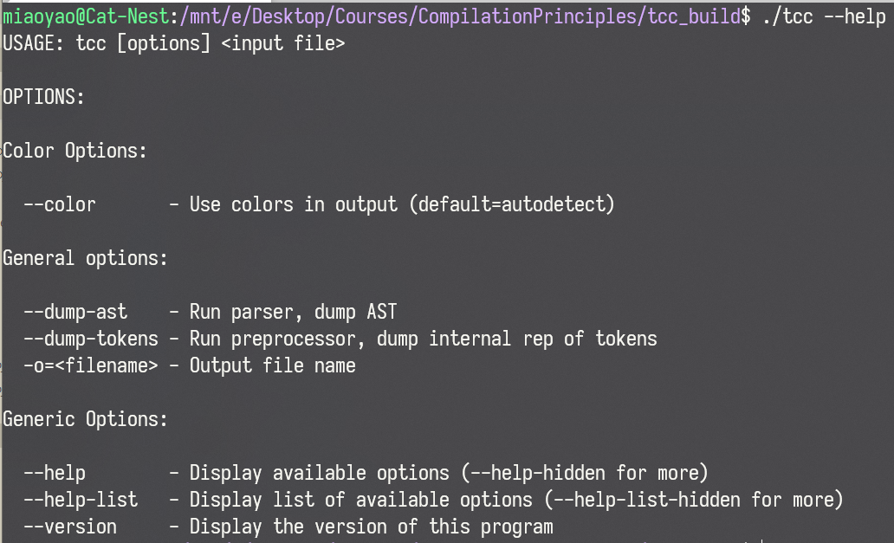
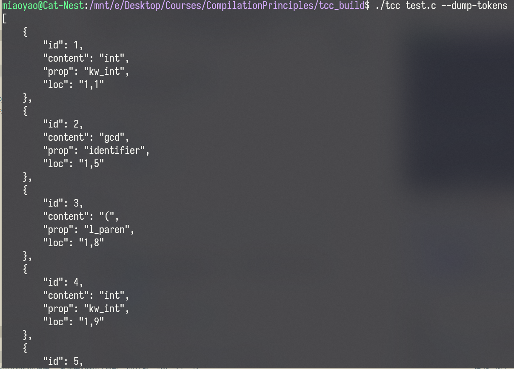
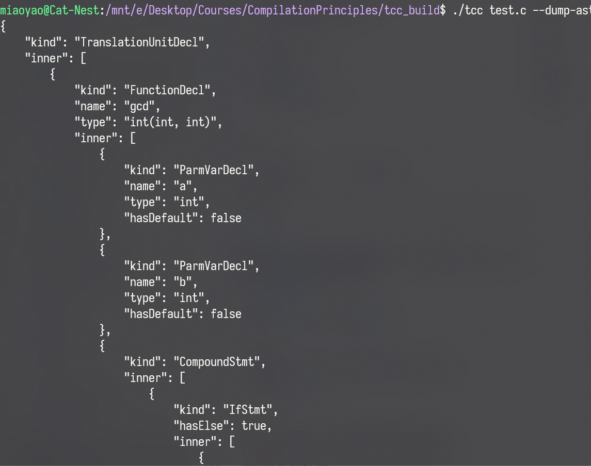
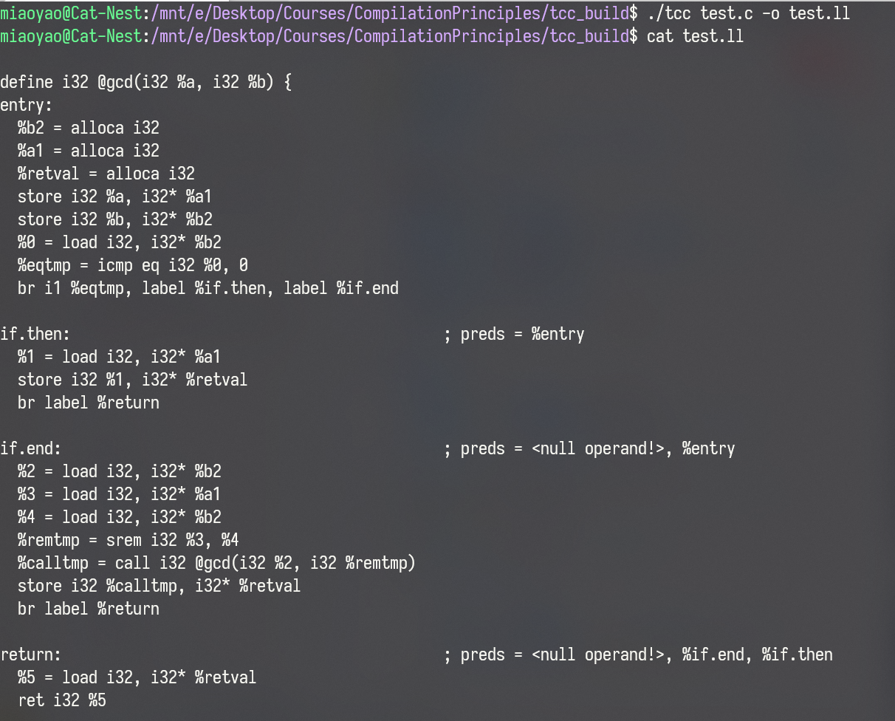
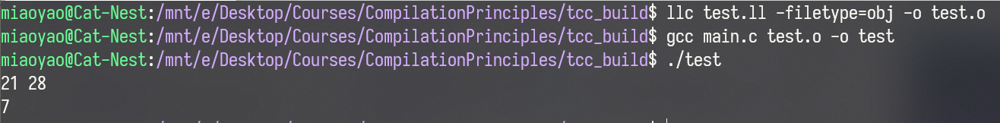

# ToyCC

## 项目简介

本项目来自[Maoyao233](https://github.com/Maoyao233)，[lhl322001](https://github.com/lhl322001)，[Amazonite](https://gitee.com/amazonite)合作完成的同济大学编译原理（CS100395）课程大作业的后端部分，针对C语言的一个子集，实现了简易的编译器前端，包括词法分析、语法分析、语义分析与中间代码生成步骤。程序可以生成`LLVM IR`，也可以单独演示词法分析部分或以json格式给出抽象语法树（AST）。完整大作业前端使用`electron`实现，主要为编译结果的可视化。

## 演示



我们使用简单的测试程序`test.c`：

```C
int gcd(int a, int b)
{
    if(b==0)
        return a;
    return gcd(b, a % b);
}
```

词法分析：



抽象语法树：


中间代码：


进一步地，我们可以使用`llc`将`LLVM IR`编译为目标文件并运行，以检验其正确性。

测试使用`main.c`：

```C
#include <stdio.h>
int gcd(int, int);
int main()
{
    int a, b;
    scanf("%d%d", &a, &b);
    printf("%d\n", gcd(a, b));
}
```



## 编译

推荐在Linux或MacOS下编译本项目。如果在Windows下编译，需要从源码编译LLVM，耗时较长且存在失败的可能性。

推荐使用[CMake](https://cmake.org/)与[vcpkg](https://github.com/microsoft/vcpkg)进行项目管理。

若未安装`vcpkg`，首先应安装`vcpkg`：

Linux:
```bash
git clone https://github.com/microsoft/vcpkg.git
cd vcpkg
sh bootstrap-vcpkg.sh
```
Windows:

在`powershell`内执行：
```powershell
git clone https://github.com/microsoft/vcpkg.git
cd vcpkg
.\bootstrap-vcpkg.bat
```

然后通过`vcpkg`安装本项目的依赖：
```bash
./vcpkg install nlohmann-json
```

LLVM发布的Windows安装版本中缺少本项目依赖的头文件与库文件，因此必须从源码编译。可以时候用`vcpkg`完成：
```powershell
.\vcpkg install llvm[core,target-x86]
```

注意，此过程可能非常漫长，请耐心等待。同时，Debug模式编译对内存的需求量很大，配置较差的电脑下可能会内存耗尽而编译失败。此时可以考虑[手动从源码编译](https://llvm.org/docs/GettingStarted.html)。

如果在Linux或MacOS下，可以直接使用LLVM的pre-built版本从而省略这一复杂艰难的过程。例如在`Ubuntu`下，只需使用：

```bash
sudo apt install llvm
```

即可使用。

在项目中应用`vcpkg`的方法请参考[官方文档](https://github.com/microsoft/vcpkg/blob/master/README_zh_CN.md#%E5%9C%A8-cmake-%E4%B8%AD%E4%BD%BF%E7%94%A8-vcpkg)，推荐将`vcpkg`作为项目子模块，即在本项目的 [CMakeLists.txt](CMakeLists.txt) 中的`project()`调用前加入以下内容：

```CMake
set(CMAKE_TOOLCHAIN_FILE path/to/vcpkg/scripts/buildsystems/vcpkg.cmake
  CACHE STRING "Vcpkg toolchain file")
```

其中`path/to/vcpkg`为`vcpkg`安装位置。

配置完成后，即可使用`CMake`：

Visual Studio:
```bash
mkdir build
cd build
cmake .. -G "Visual Studio 16 2019" 
```

MinGW:
```bash
mkdir build
cd build
cmake .. -G "MinGW Makefiles" 
```

UNIX:
```bash
mkdir build
cd build
cmake .. -G "Unix Makefiles" 
```

## 支持的语法

目前本项目仅实现了C语言很小的一个子集。

支持的关键字包括：
+ int
+ void
+ if
+ else
+ while
+ return

支持的运算符包括：
+ 一元/二元算术运算符（+，-，*，/，%等）
+  关系运算符（==，!=，<，<=，>，>=）
+ 逻辑运算符（&&，||，!）
+ 位运算符（&，|，^）
+ 移位运算符
+ 赋值运算符（=）
+ 复合赋值运算符（+=，&=，<<=等）
+ 括号

其他语言特性如：

+ 单行/多行注释
+ 变量初始化
+ 语句块
+ 递归调用

限于作业完成时间以及作者水平，项目中许多地方实现可能并不合理，有待于继续改进。